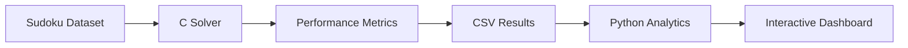

# Sudoku Intelligence Lab

An algorithm performance laboratory for analyzing an instrumented recursive backtracking Sudoku solver.

Built with C, Python, Streamlit and Plotly.

## Overview

Sudoku Intelligence Lab is an engineering project that benchmarks a recursive
backtracking Sudoku solver implemented in C.

Instead of focusing only on solving puzzles, the project measures solver
behavior by recording recursive calls, backtracks, candidate checks,
execution time and search depth across 1,000 benchmark puzzles.

The resulting dataset is analyzed statistically and visualized through an
interactive Streamlit dashboard.

## Features

- Instrumented recursive backtracking solver in C
- Benchmark dataset containing 1,000 Sudoku puzzles
- Performance metric collection
- Statistical analysis
- Linear regression modeling
- Interactive Streamlit dashboard
- Research-style findings

## Architecture

