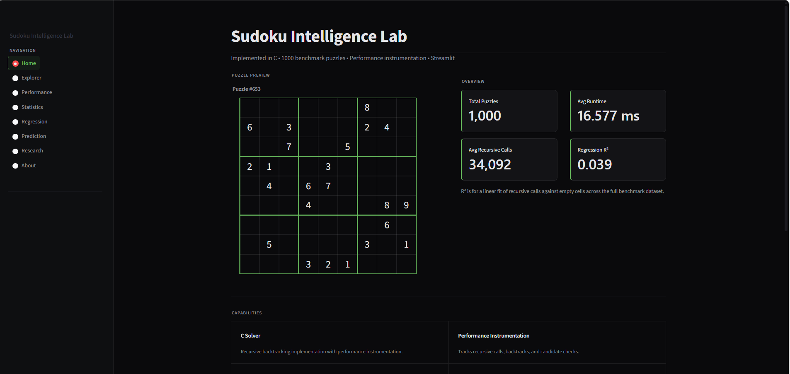
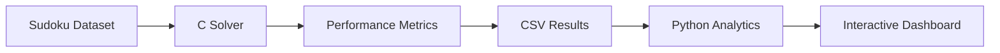
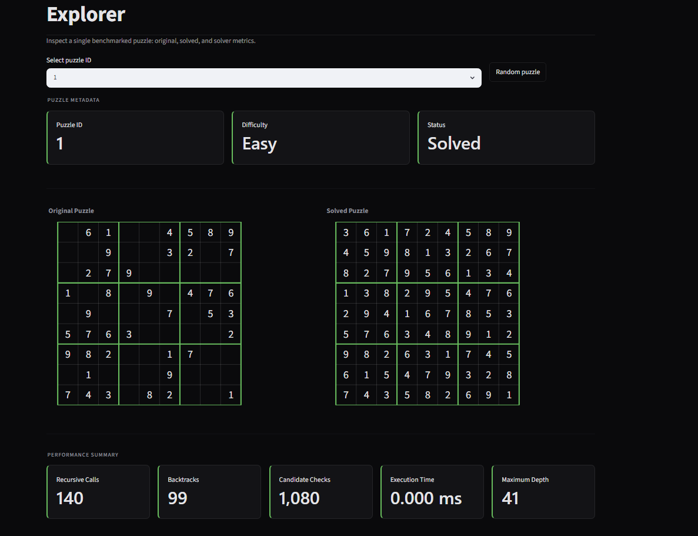
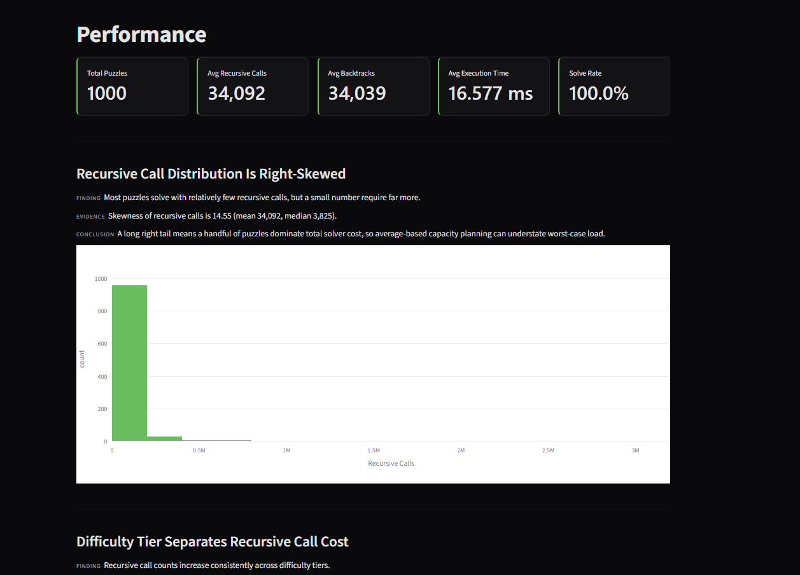
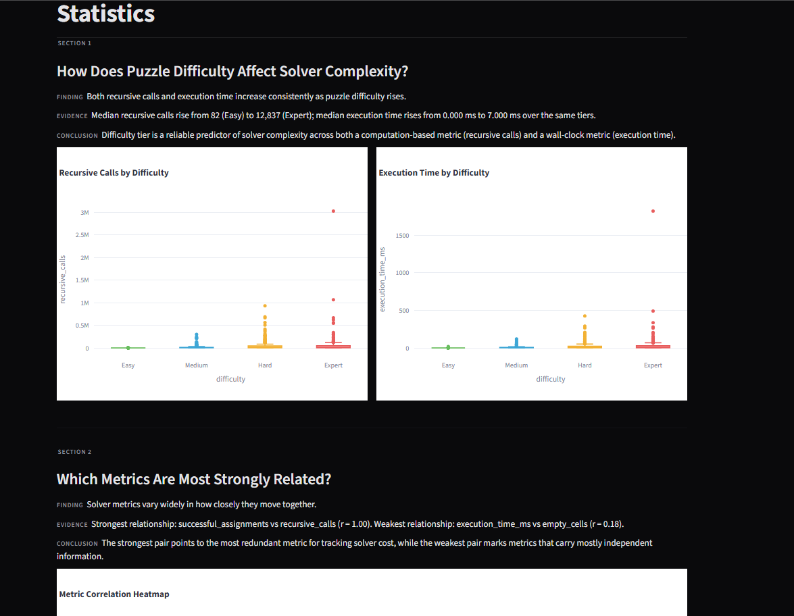
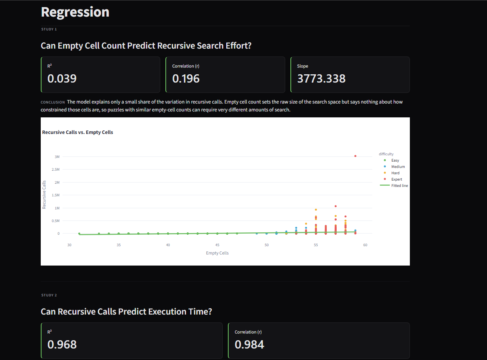
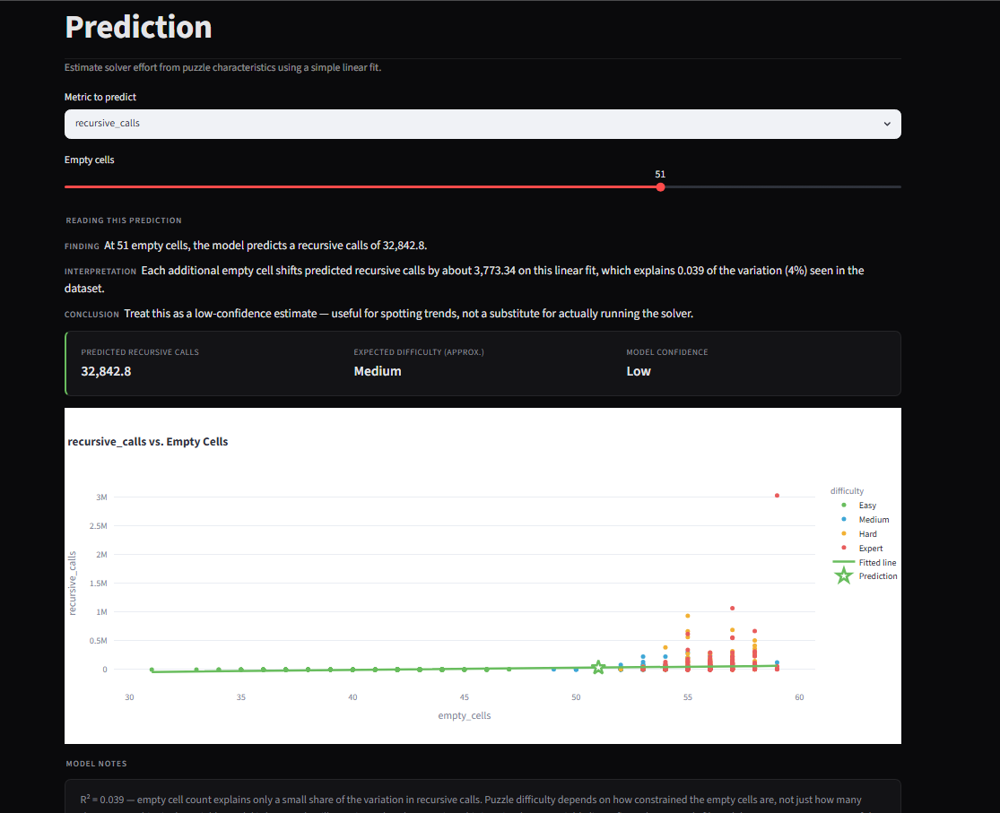
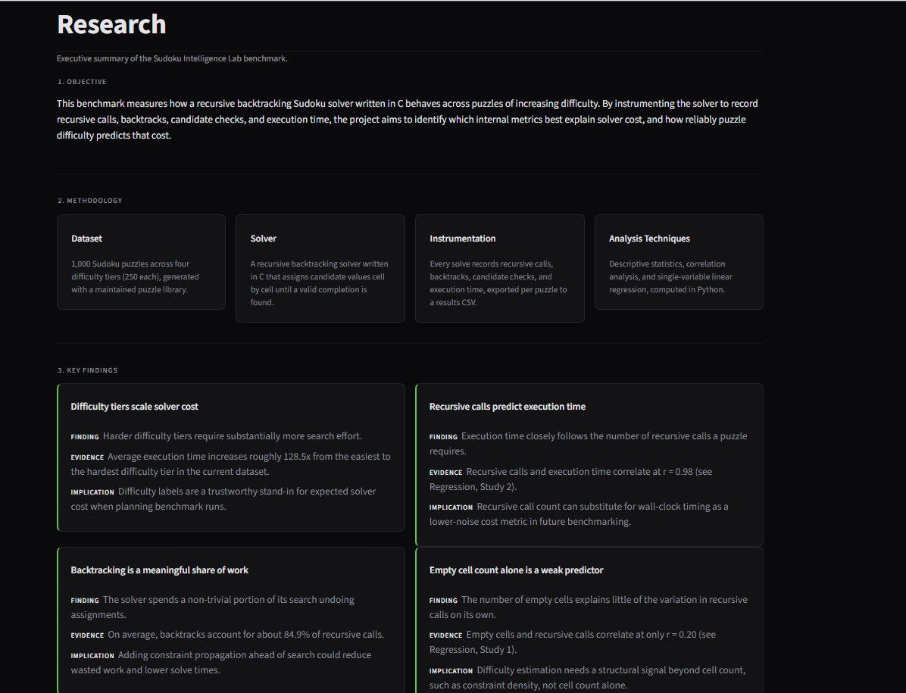

# Sudoku Intelligence Lab

An algorithm performance laboratory for analyzing an instrumented recursive backtracking Sudoku solver.

Built with C, Python, Streamlit and Plotly.


## Overview

Sudoku Intelligence Lab is an engineering project that benchmarks a recursive
backtracking Sudoku solver implemented in C.

Instead of focusing only on solving puzzles, the project measures solver
behavior by recording recursive calls, backtracks, candidate checks,
execution time and search depth across 1,000 benchmark puzzles.

The resulting dataset is analyzed statistically and visualized through an
interactive Streamlit dashboard.

## Features

- Instrumented recursive backtracking solver in C
- Benchmark dataset containing 1,000 Sudoku puzzles
- Performance metric collection
- Statistical analysis
- Linear regression modeling
- Interactive Streamlit dashboard
- Research-style findings

## Architecture



## Repository Structure

```text
Sudoku-Intelligence-Lab/
│
├── c_engine/              # Instrumented recursive backtracking solver
├── dashboard/             # Streamlit dashboard
├── python/                # Analysis and regression scripts
├── data/
│   ├── dataset/           # Sudoku benchmark dataset
│   └── output/            # Solver results
├── images/                # Dashboard screenshots
├── reports/               # Generated reports
└── README.md
```

## Performance Instrumentation

The recursive backtracking solver was instrumented to record detailed execution
metrics for every benchmark puzzle. Rather than measuring execution time alone,
the solver captures internal search behavior to better understand algorithm
performance.

| Metric | Description |
|--------|-------------|
| Recursive Calls | Total number of recursive function invocations |
| Backtracks | Number of incorrect assignments reverted |
| Candidate Checks | Safety checks performed before placing a value |
| Successful Assignments | Valid values successfully placed |
| Failed Assignments | Candidate values rejected |
| Maximum Depth | Deepest recursion level reached |
| Execution Time | Total runtime of the solver (milliseconds) |

These metrics are exported to `results.csv` and serve as the foundation for the
statistical analysis, regression models, and dashboard visualizations.

# Interactive Dashboard

The benchmark results are explored through an interactive Streamlit dashboard
designed as an algorithm performance laboratory.

### Home


Overview of the benchmark, project statistics and system architecture.

---

### Explorer



Inspect individual Sudoku puzzles, compare original and solved boards, and
review solver metrics for each benchmark.

---

### Performance



Analyze solver workload distributions, runtime behavior, and difficulty scaling.

---

### Statistics



Explore distributions, correlations and descriptive statistics across recorded
performance metrics.

---

### Regression



Evaluate regression models and compare predictor strength using R² and
correlation analysis.

---

### Prediction



Interactively estimate solver effort using the fitted regression models.

---

### Research



Summarizes the major engineering conclusions derived from the benchmark.

## Key Findings

### Recursive Calls Are the Strongest Runtime Predictor

Recursive calls explain approximately **97%** of execution time variation,
making them the most reliable indicator of computational cost.

---

### Empty Cell Count Alone Is Not Enough

Although puzzles with more empty cells generally require larger search spaces,
empty cell count alone explains only a small portion of recursive search effort.

---

### Difficulty Labels Reflect Computational Cost

Benchmark difficulty tiers produce clearly separated recursive call and runtime
distributions, validating the generated dataset.

---

### Solver Reliability

The recursive backtracking implementation successfully solved **100%** of the
1,000 benchmark puzzles.

## Technology Stack

| Layer | Technology |
|--------|------------|
| Solver | C |
| Data Generation | Python |
| Data Analysis | NumPy, Pandas |
| Dashboard | Streamlit |
| Visualization | Plotly |
| Version Control | Git & GitHub |

## Getting Started

### 1. Clone the repository

```bash
git clone https://github.com/navyanawal0310/Sudoku-Intelligencegit 
cd Sudoku-Intelligence-Lab
```

### 2. Install Python dependencies

```bash
pip install -r requirements.txt
```

### 3. Generate the benchmark dataset (if required)

```bash
python python/generate_dataset.py
```

### 4. Build and run the C benchmark

```bash
cd c_engine

gcc main.c solver.c dataset.c -o benchmark

./benchmark
```

This generates:

- `data/output/results.csv`
- `data/output/puzzles.csv`

### 5. Launch the dashboard

```bash
streamlit run dashboard/app.py
```
## Repository Contents

| Directory | Description |
|-----------|-------------|
| `c_engine/` | Instrumented recursive backtracking solver |
| `dashboard/` | Streamlit application |
| `python/` | Statistical analysis and regression scripts |
| `data/dataset/` | Benchmark Sudoku dataset |
| `data/output/` | Generated benchmark metrics |
| `images/` | Dashboard screenshots |
| `reports/` | Generated reports and research outputs |

## Future Work

- Implement heuristic-based solvers (MRV, Forward Checking)
- Benchmark Algorithm X (Dancing Links)
- Compare multiple Sudoku solving algorithms
- Expand the framework into a general CSP benchmarking laboratory
- Support larger benchmark datasets

