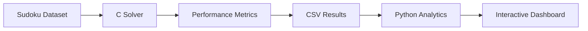

# Sudoku Intelligence Lab

An algorithm performance laboratory for analyzing an instrumented recursive backtracking Sudoku solver.

Built with C, Python, Streamlit and Plotly.


## Overview

Sudoku Intelligence Lab is an engineering project that benchmarks a recursive
backtracking Sudoku solver implemented in C.

Instead of focusing only on solving puzzles, the project measures solver
behavior by recording recursive calls, backtracks, candidate checks,
execution time and search depth across 1,000 benchmark puzzles.

The resulting dataset is analyzed statistically and visualized through an
interactive Streamlit dashboard.

## Features

- Instrumented recursive backtracking solver in C
- Benchmark dataset containing 1,000 Sudoku puzzles
- Performance metric collection
- Statistical analysis
- Linear regression modeling
- Interactive Streamlit dashboard
- Research-style findings

## Architecture


## Repository Structure

```text
Sudoku-Intelligence-Lab/

├── c_engine/
├── dashboard/
├── python/
├── data/
│   ├── dataset/
│   └── output/
├── reports/
├── images/
└── README.md
```

## Repository Structure

```text
Sudoku-Intelligence-Lab/
│
├── c_engine/              # Instrumented recursive backtracking solver
├── dashboard/             # Streamlit dashboard
├── python/                # Analysis and regression scripts
├── data/
│   ├── dataset/           # Sudoku benchmark dataset
│   └── output/            # Solver results
├── images/                # Dashboard screenshots
├── reports/               # Generated reports
└── README.md
```

## Performance Instrumentation

The recursive backtracking solver was instrumented to record detailed execution
metrics for every benchmark puzzle. Rather than measuring execution time alone,
the solver captures internal search behavior to better understand algorithm
performance.

| Metric | Description |
|--------|-------------|
| Recursive Calls | Total number of recursive function invocations |
| Backtracks | Number of incorrect assignments reverted |
| Candidate Checks | Safety checks performed before placing a value |
| Successful Assignments | Valid values successfully placed |
| Failed Assignments | Candidate values rejected |
| Maximum Depth | Deepest recursion level reached |
| Execution Time | Total runtime of the solver (milliseconds) |

These metrics are exported to `results.csv` and serve as the foundation for the
statistical analysis, regression models, and dashboard visualizations.